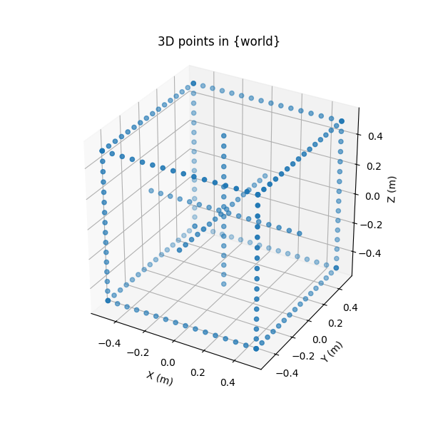

# Opti-Acoustic Sensor Fusion

## Python Simulation

A simulation is created in [`sonar_simulation.py`](/scripts/sonar_simulation.py) to reconstruct a 3D object from a opti-acoustic stereo imaging system based off the following 2 papers:

- [Epipolar Geometry of Opti-Acoustic Stereo Imaging (Negahdaripour, 2005)](https://ieeexplore.ieee.org/document/4293207)
- [Direct and Indirect 3-D Reconstruction from Opti-Acoustic Stereo Imaging (Sekkati & Negahdaripour, 2006)](https://ieeexplore.ieee.org/abstract/document/4155781)

A 3D box is projected using the asymmetric optical and sonar projection models to create 2D camera and sonar images.

Only the azimuth solution was successfully replicated to recover the depth information. The image below shows the result of the indirect method to reconstruct the object with noisy measurements, using the epipolar constraint as a regularization parameter.

The configuration for the simulation can be easily adjusted in the [config/sim_config.yaml](config/sim_config.yaml) file.
